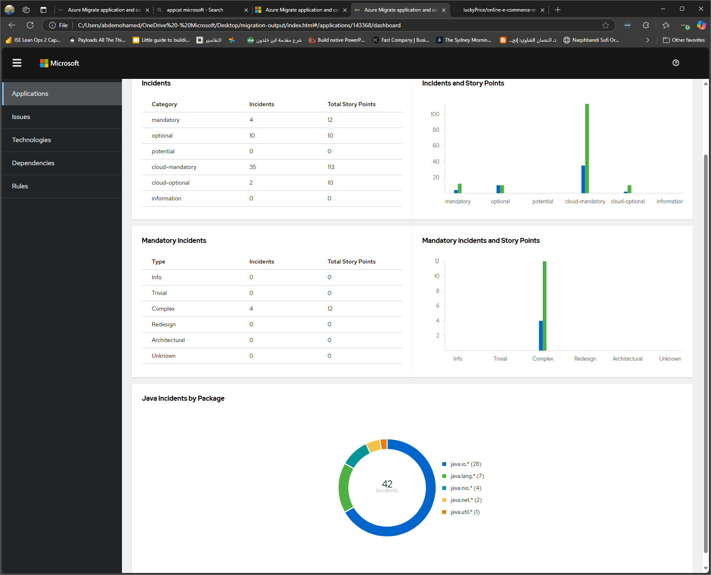

# AppCat DevContainer

## Overview

This repository provides an environment for playing with app-cat. The container, is based on OpenJDK-17 which is a requirement for executing APPCat. There is a post-create script ```install.sh``` which would download the appcat application to the ```tools folder```. 

## Things to know

- The ```Tools folder``` will have the appcat tool installed
- Home java folder is exported an en variable named ```JAVA_HOME```
- The ```install.sh``` will export appcat executable to the PATH env variable. so it can be accessed like this ```appcat```
- The dev-container clone a sample public repository named ```online-e-commerce-marketplace-project-backend``` to the ```repos folder```
- To play with appcat you can run analysis on the cloned repository

The below command, would:
- Run appcat against online-e-commerce-marketplace-project-backend repository for analysis.
- The appcat provide different targets to choose from when running analysis. For e.g. cloud-readiness, discover... etc click [here](https://learn.microsoft.com/en-us/azure/migrate/appcat/java#assess-a-java-application) to read more about these targets. 
- The appcat command will persist the report of the analysis to the ```migrated-output``` folder. 
```
appcat --input repos/online-e-commerce-marketplace-project-backend/ --target discovery cloud-readiness azure-appservice --output ./migration-output
```

Here is a sample of report 
